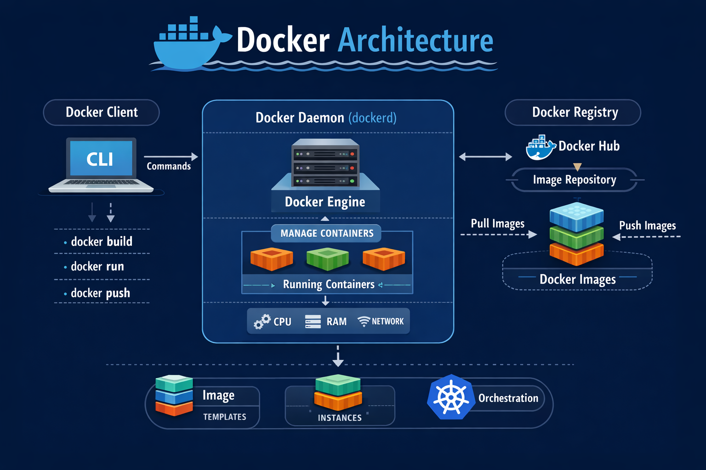
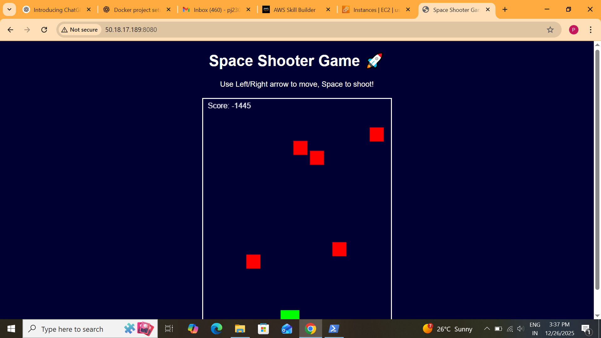

# Space-Shooter-Game-Using-Docker

## Docker Architecture Overview

Docker is a **containerization platform** that allows developers to package applications with all dependencies into isolated containers.  
This architecture overview explains how Docker components interact to build, ship, and run containers efficiently.

## Docker Components

| Component        | Description |
|-----------------|-------------|
| **Docker Client** | CLI interface (`docker` command) used by users to interact with Docker. |
| **Docker Daemon (dockerd)** | Background service managing containers, images, networks, and volumes. |
| **Docker Engine** | Core runtime responsible for running containers on the host OS. |
| **Docker Images** | Read-only templates used to create containers. Built via Dockerfile. |
| **Docker Containers** | Running instances of Docker images, isolated and lightweight. |
| **Docker Registry** | Storage and distribution for Docker images (e.g., Docker Hub, private registries). |

## Project Structure

    docker-project/
    │
    ├─ Game.html # Space Shooter HTML
    ├─ Dockerfile # Dockerfile to build   container
    ├─ Img/
    └─ README.md # Project description

## 1. Launch A Instance

## 2. Connect via SSH:

    ssh -i your-key.pem ec2-user@<EC2_PUBLIC_IP>

## 3. Install Docker & start service:

      sudo yum update -y
      sudo yum install docker -y
      sudo systemctl start docker
      sudo systemctl enable docker
      sudo systemctl status docker

## 4. Create A Folder
      mkdir docker
      cd docker

## 5. Build Docker image:

       docker build -t space-shooter .
## 6. Stop any old container (if running):

       docker ps
      docker stop <CONTAINER_ID>

## 7. Run the Docker container:
 
      docker run -d -p 8080:80 space-shooter

## 8. Open your browser:

    http://localhost:8080
    
## Output:

## Key Points

- Containers are **lightweight** and **portable**.  
- Each container has **isolated filesystem, processes, and network**.  
- Images are **layered** and **reusable**.  
- Docker follows a **client-server architecture**: client communicates with daemon.  

## Conclusion

This project demonstrates a complete end-to-end Docker-based application deployment, starting from understanding Docker architecture to running a real-time browser-based game inside a container.

By containerizing the Space Shooter game, the project highlights Docker’s ability to create portable, lightweight, and scalable applications.

It also provides hands-on experience with cloud instances, Docker images, containers, and networking, making it a strong example of practical DevOps and cloud skills.

## Author

Pooja Jadhav